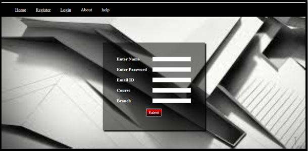
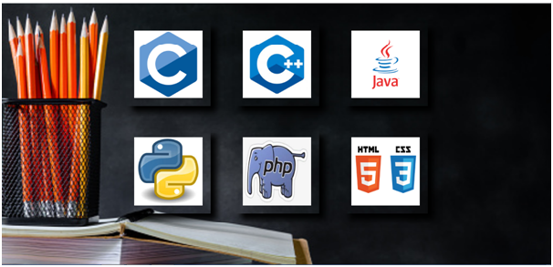
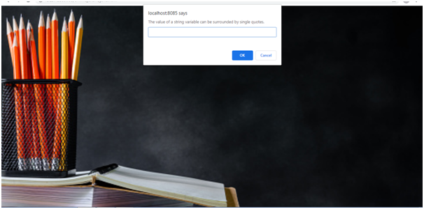
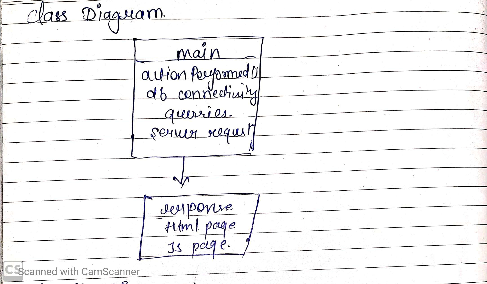
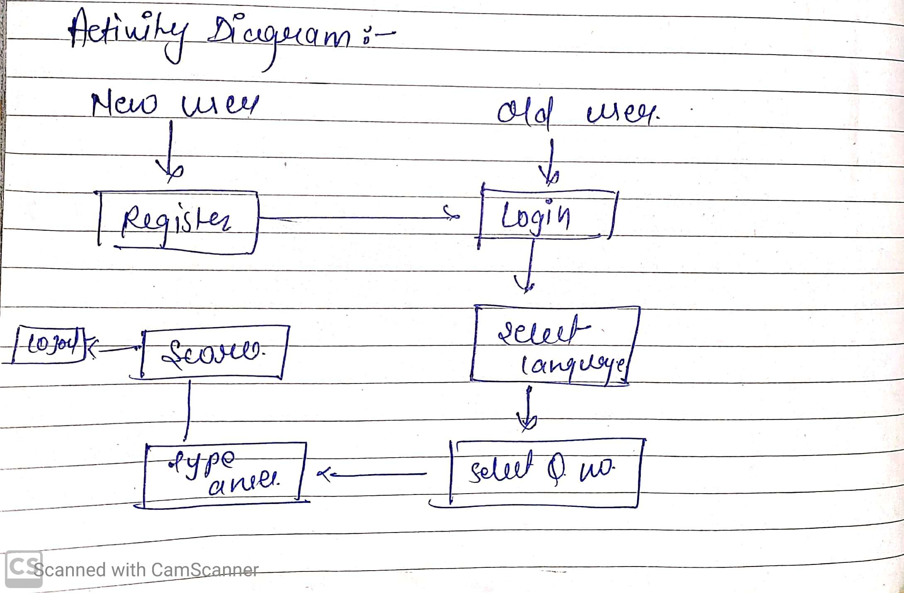
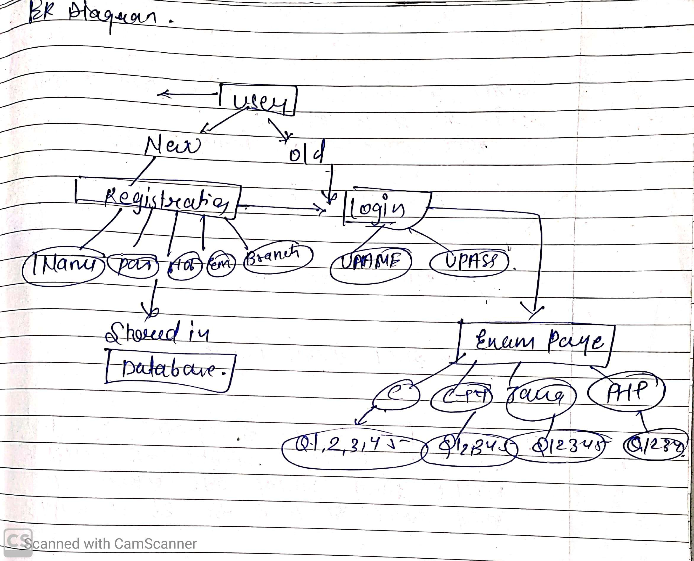

# Quiz-Project
# Quiz-Project# Quiz-Project
<b><h4>Objective</h4></b> 
A software which is use to play quiz on programming languages.In application a user can register first.User information is stored in databases and then user login and ready to give quiz exam.There are different programing languages like- JAVA,PHP,PYTHON,HTML,C,C++ in which user give quiz exam.

  <b><h4>Functional Requirement</b></h4> 
  1.New user first register  
  2. Login user 
  3.Select programming language  
  4.Select Question no. 
  5.Give answer 
  6.Submit answer 
  7.scored are display 
  <b>Tool used</b> 
 1. cmd and Jdk 
2. Os:-Windows 7 
3. Backend:-Mysql and JAVASCRIPT 
4. Front End:-HTML  
5. Database Connectivity:-JDBC 
6.Servlet:- apache tomcat 

<b><h4>HOW PROJECTS WORK</h4></b> 

1. Home page 
 

2. New User Register first
 

3. Then Login 

 
4. Then give quiz exam on click exam:-
 

5. Then choose programming language:-

 
6. Then select question numbers :-

 
Question display in prompt box and  write correct answer 

 

7. Total score display 
 

Class Diagram
 
 Activity 

 ER Diagram
 

  
